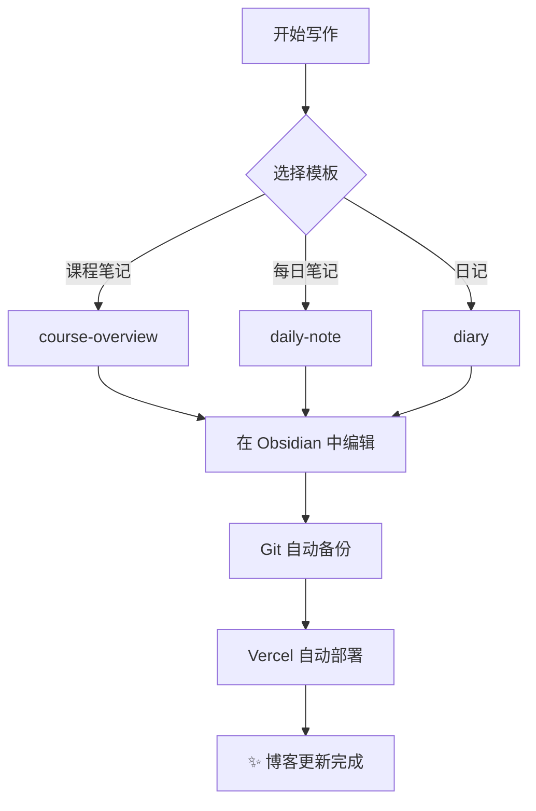
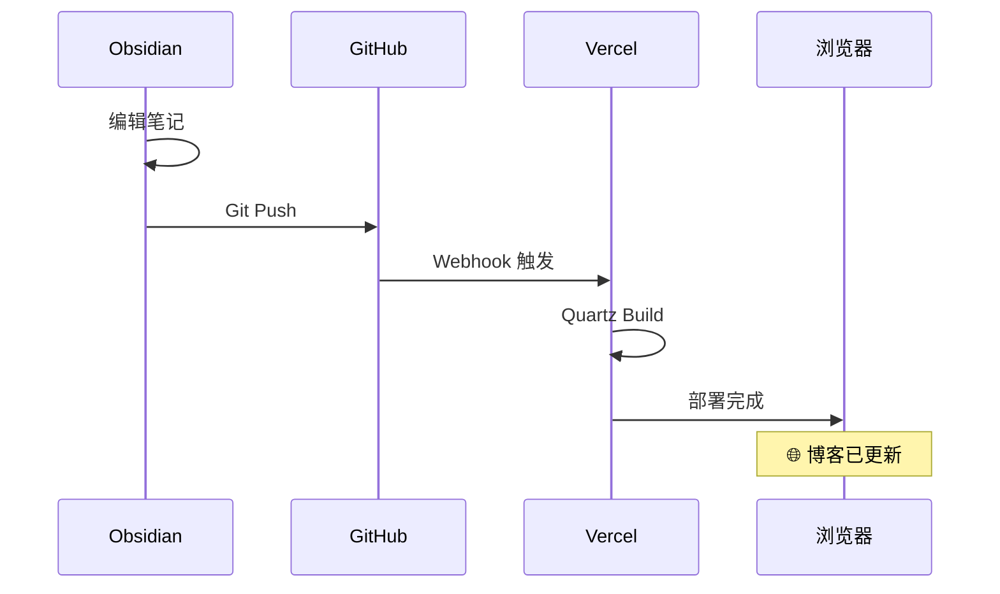

# ✨ 功能展示

> 本页面展示了 Quartz 博客系统支持的全部 Markdown 功能。如果你能看到这个页面渲染正常，说明你的博客部署成功！

---

## 📝 文本格式化

**粗体文字**、*斜体文字*、***粗斜体***、~~删除线~~、`行内代码`、==高亮文字==。

上标：X^2^，下标：H~2~O。

---

## 🔗 链接与引用

- **内部链接**：[[00-Inbox/Base|前往收集箱]]
- **外部链接**：[Quartz 官方文档](https://quartz.jzhao.xyz)
- **Wiki 链接**：[[demo-math|数学公式测试]]

---

## 📊 表格

| 功能 | 支持 | 备注 |
|------|:---:|------|
| Markdown 基础语法 | ✅ | 标题、列表、链接等 |
| LaTeX 数学公式 | ✅ | 行内 + 块级 |
| 代码高亮 | ✅ | 多语言支持 |
| Callout 提示框 | ✅ | Obsidian 风格 |
| Mermaid 图表 | ✅ | 流程图、时序图 |
| 中文排版 | ✅ | 全角标点正常 |
| 日文/韩文 | ✅ | 日本語、한국어 |

---

## 📐 数学公式

### 行内公式

质能方程 $E = mc^2$，欧拉公式 $e^{i\pi} + 1 = 0$。

### 块级公式

**柯西-施瓦茨不等式：**

$$
\left( \sum_{i=1}^{n} x_i y_i \right)^2 \leq \left( \sum_{i=1}^{n} x_i^2 \right) \left( \sum_{i=1}^{n} y_i^2 \right)
$$

**贝叶斯定理：**

$$
P(A|B) = \frac{P(B|A) \cdot P(A)}{P(B)}
$$

**多元微积分：**

$$
\iiint_V \nabla \cdot \mathbf{F} \, dV = \oiint_S \mathbf{F} \cdot d\mathbf{S}
$$

**矩阵表示：**

$$
\begin{pmatrix}
a_{11} & a_{12} & \cdots & a_{1n} \\
a_{21} & a_{22} & \cdots & a_{2n} \\
\vdots & \vdots & \ddots & \vdots \\
a_{m1} & a_{m2} & \cdots & a_{mn}
\end{pmatrix}
$$

---

## 💻 代码块

### Python

```python
import numpy as np
from sklearn.linear_model import LinearRegression

# 简单线性回归
X = np.array([[1], [2], [3], [4], [5]])
y = np.array([2, 4, 5, 4, 5])

model = LinearRegression()
model.fit(X, y)
print(f"斜率: {model.coef_[0]:.3f}")
print(f"截距: {model.intercept_:.3f}")
print(f"R²: {model.score(X, y):.3f}")
```

### C++

```cpp
#include <iostream>
#include <vector>
#include <algorithm>

template<typename T>
auto quickSort(std::vector<T>& arr, int low, int high) -> void {
    if (low >= high) return;
    auto pivot = arr[high];
    auto i = low - 1;
    for (auto j = low; j < high; ++j) {
        if (arr[j] <= pivot) {
            ++i;
            std::swap(arr[i], arr[j]);
        }
    }
    std::swap(arr[i + 1], arr[high]);
    quickSort(arr, low, i);
    quickSort(arr, i + 2, high);
}
```

### R

```r
library(tidyverse)

# 数据可视化
ggplot(mtcars, aes(x = wt, y = mpg, color = factor(cyl))) +
  geom_point(size = 3) +
  geom_smooth(method = "lm", se = FALSE) +
  labs(
    title = "汽车重量与油耗关系",
    x = "重量 (1000 lbs)",
    y = "油耗 (mpg)",
    color = "气缸数"
  ) +
  theme_minimal()
```

---

## 🖼️ Mermaid 图表

### 流程图



### 时序图



---

## 📦 Callout 提示框

> [!note] 笔记
> 这是一个普通的笔记 Callout。

> [!info] 信息
> 这是补充信息。

> [!tip] 小技巧
> 按 `Ctrl+P` 可以快速打开命令面板。

> [!warning] 注意
> 修改 `custom.scss` 后需要重新构建才能生效。

> [!danger] 危险
> 不要直接修改 `node_modules` 中的文件。

> [!example] 示例
> 这是一个示例 Callout，常用于展示代码或步骤。

> [!quote] 引用
> "知识的岛屿越大，无知的海岸线越长。" — 爱因斯坦

> [!abstract] 摘要
> 本文展示了 Quartz 博客系统的全部 Markdown 功能。所有功能均正常工作。

> [!success] 完成
> 你的博客已经成功部署！

> [!question] 问题
> 为什么数学公式可以渲染？因为启用了 KaTeX 插件。

---

## 🌐 多语言文字

### 中文

欢迎来到我的数字花园。这里记录着我的学习、思考和创造。

### English

Welcome to my digital garden. This is where I document my learning, thoughts, and creations.

### 日本語

私のデジタルガーデンへようこそ。ここには学びと思考と創造の記録があります。

### 한국어

나의 디지털 정원에 오신 것을 환영합니다. 이곳은 배움과 사고와 창조의 기록입니다.

### Français

Bienvenue dans mon jardin numérique. C'est ici que je consigne mes apprentissages, réflexions et créations.

### Русский

Добро пожаловать в мой цифровой сад. Здесь я записываю свои знания, мысли и творчество.

### العربية

مرحبًا بك في حديقتي الرقمية. هنا أسجل تعلمي وأفكاري وإبداعي.

---

## 📋 任务列表

- [x] Fork 模板仓库
- [x] 配置 Obsidian
- [x] 安装必要插件
- [x] 连接内容目录
- [x] 自定义配色
- [x] 部署到 Vercel
- [ ] 绑定自定义域名
- [ ] 写第一篇博客

---

## 🎵 脚注测试

这是一段带有脚注的文本[^1]，这是另一个脚注[^2]。

[^1]: 第一个脚注的内容。支持 **Markdown** 语法。
[^2]: 第二个脚注。可以参考 [Quartz 文档](https://quartz.jzhao.xyz)。

---

## 📂 文件夹结构

```
Notes/
├── index.md          ← 你正在看的页面
├── 00-Inbox/         ← 收集箱
├── 01-Courses/       ← 课程笔记
├── 02-Diary/         ← 日记
├── 03-Music/         ← 音乐
├── 04-Templates/     ← 模板
└── assets/           ← 附件
```

---

> 如果你看到这里一切正常，恭喜！你的数字花园已经完美运行 🌸
